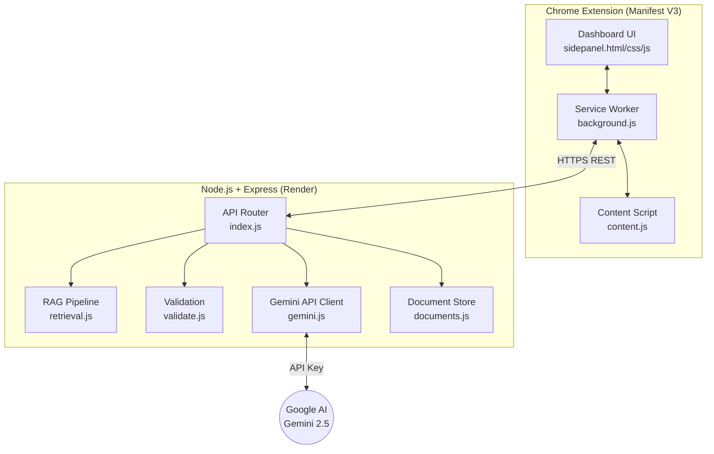

# TaxPilot Copilot

AI Tax Filing Copilot — Review, Validate, File with Confidence.

TaxPilot Copilot transforms your browser into an intelligent financial dashboard, ensuring your Indian Income Tax returns are accurate and optimized before you hit submit.

---

## 🌟 Overview

Filing taxes shouldn't be a guessing game. TaxPilot Copilot acts as your personal tax reviewer directly on the Income Tax portal:

- **Intelligent Validation:** Cross-references portal fields against your uploaded documents (Form 16, Salary Slips).
- **Tax Knowledge Base:** Proactively applies over 60 curated Indian tax rules to ensure you're claiming the right deductions.
- **Filing Health Score:** Get a clear, confidence-backed health score for your current page.
- **Privacy First:** Your documents are analyzed in-memory and never permanently stored.

## 📐 Architecture

TaxPilot Copilot consists of a lightweight Chrome extension and a robust Express backend.



## 🚀 Installation Guide

### 1. Backend Setup

```bash
cd backend
cp .env.example .env
# Add your Gemini API key to .env: GEMINI_API_KEY=your_actual_key_here
npm install
npm run dev
```

### 2. Extension Setup

1. Open Chrome and navigate to `chrome://extensions/`
2. Enable **Developer mode**
3. Click **"Load unpacked"** and select the `extension/` folder
4. The TaxPilot icon will appear in your toolbar. Pin it for easy access.

## 📚 API Documentation

The backend exposes several key endpoints for the extension:

- `POST /api/documents/session` - Initializes a new document upload session
- `POST /api/documents/upload` - Securely uploads Form 16 / Salary Slips to memory
- `POST /api/explain-page` - Explains current portal page fields
- `POST /api/explain-selection` - Explains user-highlighted text
- `POST /api/review-page` - Full RAG pipeline validation against rules and documents

## 🛠 Development Guide

TaxPilot uses plain HTML, CSS, and vanilla JS for the extension to minimize bundle size, ensuring snappy performance.

- **Developer Mode:** Click the version badge in the extension header 3 times to reveal the Developer Panel, showing model metadata, token counts, and processing times.
- **Theme:** The extension uses a sleek, light-themed financial dashboard aesthetic by default, with built-in dark mode support.

## 🚀 Deployment Guide

1. **Backend:** Deploy the `backend/` folder to Render or Railway. Make sure to set `GEMINI_API_KEY`.
2. **Extension:** Build the extension by zipping the `extension/` folder. Submit to the Chrome Web Store Developer Dashboard.

---

## License

This project is for personal use and learning purposes.
